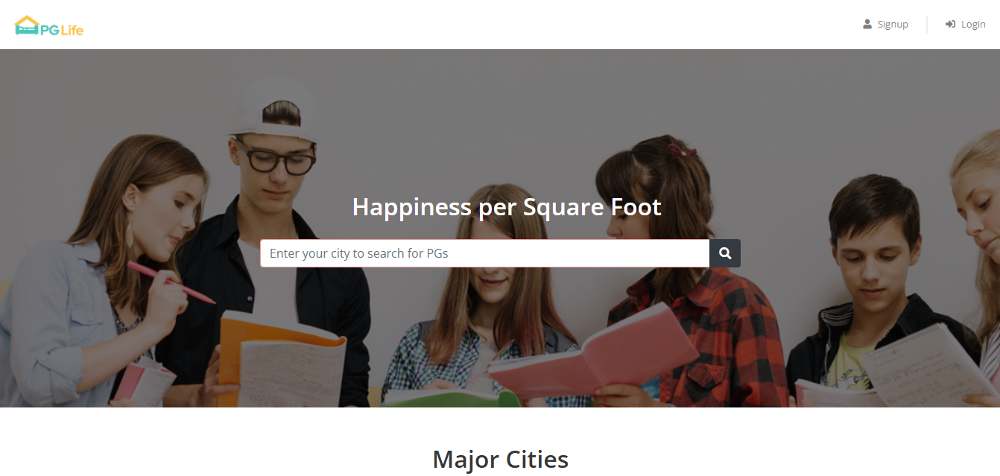

# 🏠 PGLife - Student Accommodation Finder 🎓

**PGLife** is a web-based platform designed to make finding suitable accommodations easier for students joining colleges or universities. The application allows users to search for PGs (Paying Guest accommodations) based on city, view detailed property listings, and manage preferences through a personalized dashboard.

---
## 📸 Preview

 <!-- Optional: Add a preview GIF or another screenshot -->

---
## ✨ Features

1. 🔐 **User Registration & Login**

   * Sign up and log in securely using email and password.
   * Data is stored in the `users` table in MySQL.

2. 🏙️ **City-Specific Search Functionality**

   * Search for PG accommodations by entering the city in the search bar.
   * View a list of PGs available in the selected city.

3. 📋 **Property Details**

   * View detailed information for each property: amenities, price, location & more.
   * Data comes from the `properties` table.

4. 🧑‍💻 **Personalized Dashboard**

   * Manage saved properties and personal profile in one place.
   * See your list of 'interested' properties.

5. 🚪 **Secure Logout**

   * Safely end user sessions with the logout feature.

---

## 🧰 Tech Stack

* **Frontend:** HTML, CSS, Bootstrap, JavaScript, React ⚛️
* **Backend:** PHP 🐘, MySQL 🐬

---

## ⚙️ Installation

1. 📥 Clone the repository:

   ```bash
   git clone https://github.com/YourUsername/PGLife.git  
   ```

2. 📁 Move into the project directory:

   ```bash
   cd PGLife  
   ```

3. 🛠️ Set up the MySQL database:

   * Import `pglife.sql` into your MySQL server.
   * Ensure `users` and `properties` tables are created.

4. 🔑 Update database credentials:

   * Edit `db.php` with your MySQL username and password.

5. 🚀 Start the local server:

   * Use **XAMPP**, **WAMP**, or any local server tool.
   * Place the project folder in the `htdocs` directory (for XAMPP).

6. 🌐 Access the application:

   * Open a browser and go to `http://localhost/PGLife`.

---

## 🧪 Usage

1. 📝 Register a new account or login with an existing one.
2. 🔍 Search PGs by entering a city name.
3. 🏢 Browse detailed listings and mark properties you like.
4. 📂 Manage preferences via your personal dashboard.

---

## 🚀 Future Enhancements

* 🔍 Add filters (price range, amenities, sharing options, etc.)
* 💬 Messaging system to connect users with property owners.
* 🗺️ Google Maps integration for pinpoint locations.

---
